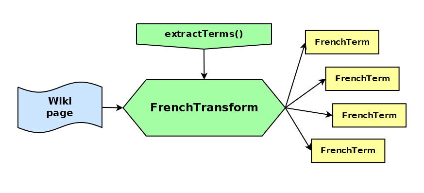

# RayonJS

_Explore the GLAWI French dictionary, with TypeScript_


[](https://badge.fury.io/js/@giancosta86%2Frayon)
[](/LICENSE)



**RayonJS** is a _TypeScript_ library dedicated to _extracting_ and _transforming_ a subset of the excellent [GLAWI](http://redac.univ-tlse2.fr/lexiques/glawi.html) French dictionary; even more, it is a plugin for [JardineroJS](https://github.com/giancosta86/JardineroJS), thus creating a SQLite-based dictionary of French terms.

## Installation

To install the package as a plugin, please refer to the documentation of [JardineroJS](https://github.com/giancosta86/JardineroJS).

> The current version of the plugin requires Jardinero 2.x

Otherwise, to install it as a library reference within a project:

```bash
npm install @giancosta86/rayon
```

or

```bash
yarn add @giancosta86/rayon
```

The public API entirely resides in the root package index, so you shouldn't reference specific modules.

## Usage

RayonJS is designed as _a plugin_ for [JardineroJS](https://github.com/giancosta86/JardineroJS): please, consult its documentation for details.

However, you can also reference the package as a **standalone library** for extracting French terms from GLAWI; in this case, you can just import names directly from its root:

```typescript
import {...} from "@giancosta86/rayon"
```

In particular, you may want to consider:

- `FrenchTransform` - a SAX-based _transform stream_

- the `FrenchTerm` union type - and the related types like `Verb`, `Noun`, `Article`, ...

- `FRENCH_SQLITE_SCHEMA`: a string containing _the DDL code_ for SQLite

- `createFrenchWritableBuilder()` - creating a `WritableBuilder` (from the [sqlite-writable](https://github.com/giancosta86/sqlite-writable) library) with the required _type registrations_ and with a suitable _transaction capacity_

## Special thanks

Special thanks to the magnificent [GLAWI](http://redac.univ-tlse2.fr/lexiques/glawi.html) project.

> Certains droits sont réservés. GLAWI est diffusé sous licence Creative Commons By-SA 3.0.
> Le logo de GLAWI est réalisé par Darwin.

## Further reference

For more details, you are all invited to explore:

- [JardineroJS](https://github.com/giancosta86/JardineroJS) - the web stack itself, designed for _extensible linguistic analysis_

- [JardineroJS - SDK](https://github.com/giancosta86/JardineroJS-sdk) - the development kit for _creating your own plugins_
